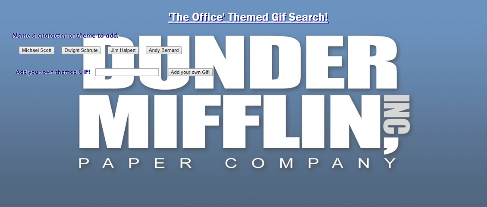
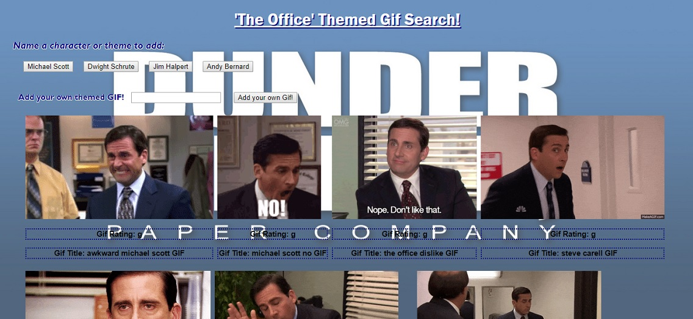
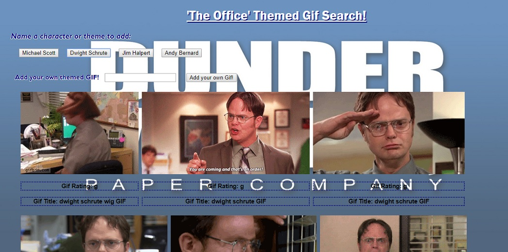

# 'The Office' Themed Giphy Project!
___

For this project we were tasked with creating a themed web page, that would utilize Giphy's API, to use AJAX calls to show the top 10 gif images for a specific topic.  The user has the ability to freeze and unfreeze the gifs by clicking on them, and also they are able to do any custom search using the search box and adding a button to use from there!  Adding gifs through the pre-set buttons, or through the search box and adding new buttons, the API call the provides the top 10 gifs for the theme they selected.  The page gives the user the option to input another search term into a text box to add that button to the screen, and then that term would be used in a giphy search to append those Gifs to the top of the page.  Coding the HTML and CSS was more on the simpler side as there was not much body to the page, but the jQuery and AJAX calls were definitely a bit more complicated.  Using past exercises, I was able to layout the adding of the buttons and the classes and attributes that went along with them, but the most difficult part for me was the appending the 'rating' and the 'gif' to the page.  After researching and reaching out for some help, the solution was basically re-writing the code I had, and got it working from there.  Most likely there was a small typo or something that we could not find.

___

___

___

___

The only other difficulty I found was laying out the gifs in an easier to read layout (in a table or gallery form), and then the pausing and playing the gifs on click.  Basically, I was able to have the gif appear on screen either animated or still, but the clicking to alternate was not working, even though when I inspected the gif added to the screen - I was able to see that it was calling both the normal gif and the still gif url.  After taking some further time on this and talking with a colleague, he was able to show me where the confusion was in the jQuery code - (by adding the 
 class in with the document.on("click"), it was able to corrected from there.  Then we also talked about wrapping the entire 
 I made into a larger 
, so that I was able to edit the layout and look of the called gifs with my CSS also.  Other than that, I added the gif title (to add in a bonus step of grabbing another meta information from the gifs), and added code in the HTML <meta> tag so the page would be responsive on all size screens.  Enjoy!
  
### Prerequisites & Installing

To install or run the site, simply navigate to the GitHub hosted link provided, or the user would be able to clone the repo to their local machine and run the HTML file from there.

## Built With

* [HTML]
* [JavaScript]
* [jQuery]
* [AJAX]

## Authors

* **Matt Williams** - *Initial work* - [M Williams Portfolio](https://mattwills09.github.io/portfolio.html)
